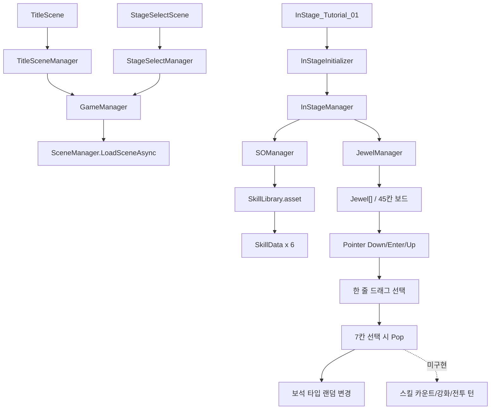

# LLL 개발 상태 분석

분석 기준일: 2026-05-18  
분석 범위: `Assets/ExternalAssets`, `Assets/Scenes`, `Packages`, `ProjectSettings/EditorBuildSettings.asset`

## 1. 전체 상태 요약

LLL 프로젝트는 사용자가 설명한 방향과 대체로 같은 초기 프로토타입 구조를 갖추고 있습니다. 스크립트는 `Assets/ExternalAssets/Scripts` 아래에 `Managers`, `Puzzle`, `SOScripts`, `Utilities`로 분리되어 있고, 씬은 `Assets/Scenes`, 프리팹은 `Assets/ExternalAssets/Prefabs`, SO 에셋은 `Assets/ExternalAssets/SO`에 배치되어 있습니다.

현재 구현은 “타이틀/스테이지 선택/인스테이지 더미 씬 + 보석판 드래그 Pop 프로토타입 + 스킬 SO 데이터 샘플” 단계로 보는 것이 적절합니다. 다만 씬 버튼의 과거 클래스명 참조, 런타임 스크립트의 `UnityEditor` 의존, Singleton 구현의 유일성 보장 미흡 등은 실제 플레이 흐름과 빌드 안정성에 영향을 줄 수 있습니다.

## 2. 의도 대비 실제 구현 대조

| 항목 | 의도 | 실제 확인 결과 | 판단 |
| --- | --- | --- | --- |
| 스크립트 위치 | `Assets/ExternalAssets/Scripts` 아래 기능별 분리 | `Managers`, `Puzzle`, `SOScripts`, `Utilities`로 분리됨 | 대체로 일치 |
| Manager 유일성 | Manager 인스턴스는 `MonoSingleton` 사용 | `GameManager`, `TitleSceneManager`, `JewelManager`, `SceneInitializer` 계열은 사용. `StageSelectManager`, `InStageManager`, `SOManager`는 일반 `MonoBehaviour` | 일부만 일치 |
| 초기화 제어 | Scene Initializer로 초기화 시점 제어 | `TitleSceneInitializer`, `SelectSceneInitializer`, `InStageInitializer` 존재. 각 씬 매니저 `Initialize()` 호출 구조 | 방향은 일치 |
| ScriptableObject 데이터 | Skill/Library를 SO로 관리 | `SkillData`, `SkillLibrary`, 샘플 스킬 6개와 `SkillLibrary.asset` 존재 | 일치 |
| 스테이지 선택 | 더미 버튼으로 스테이지 진입 | UI와 일부 버튼 이벤트 존재. 단, 다수 버튼이 `LLL.SelectManager` 구 클래스명을 참조 | 부분 동작 가능성 낮음 |
| 인스테이지 퍼즐 | 빈 보석판에서 드래그 연결 후 Pop | `JewelManager`/`Jewel`로 드래그 선택, 7칸 선택 시 Pop 및 타입 변경 구현 | 프로토타입 구현됨 |
| 7x7 - 4 = 45 보드 | 모서리 제외 45칸 | `InStage_Tutorial_01`에 `Jewel` 스크립트 다수 배치 확인. 배열 구성은 프리팹 인스턴스 기반 | 구조상 구현됨 |
| 스킬 강화/전투 턴 | Pop 수에 따른 1~3단계 스킬 발동 | 스킬 데이터 구조만 있음. Pop 결과를 스킬 카운트/전투 턴으로 넘기는 로직은 없음 | 미구현 |

## 3. 주요 코드 구조와 데이터 흐름

### 전역/씬 흐름

1. `GameManager`
   - 위치: `Assets/ExternalAssets/Scripts/Managers/GameManager.cs`
   - `MonoSingleton<GameManager>`를 상속합니다.
   - 씬 이름 규칙을 가지고 `TitleScene`, `StageSelectScene`, `InStage_{Theme}_{Number}` 형태로 씬을 로드합니다.
   - `TitleSceneStartCall()`은 `StageSelectScene`으로 이동합니다.
   - `SelectSceneStartCall(StageType, int)`은 인스테이지 씬으로 이동합니다.
   - `QuitGame()`은 에디터/빌드 종료 분기 구조를 갖고 있습니다.

2. Scene Initializer 계열
   - 위치: `Assets/ExternalAssets/Scripts/Utilities/SceneInitializer`
   - `TitleSceneInitializer`, `SelectSceneInitializer`, `InStageInitializer`가 각 씬 매니저를 찾거나 프리팹으로 생성한 뒤 `Initialize()`를 호출합니다.
   - 현재 프리팹 기준으로 각 Initializer는 해당 Manager 프리팹 및 `GameManager` 프리팹 참조를 보유합니다.

3. 씬별 매니저
   - `TitleSceneManager`: 타이틀 버튼 호출을 받아 `GameManager`에 위임합니다.
   - `StageSelectManager`: 스테이지 버튼 호출을 받아 `GameManager.SelectSceneStartCall()`에 위임합니다.
   - `InStageManager`: `SOManager.Initialize()` 후 `JewelManager.Initialize(sOManager)`를 호출합니다.
   - `SOManager`: `SkillLibrary` 참조를 보유하고, 누락 시 예외를 발생시킵니다.

### 퍼즐/보석 흐름

1. `InStageManager.Initialize()`
2. `SOManager.Initialize()`로 `SkillLibrary` 유효성 확인
3. `JewelManager.Initialize(sOManager)`
4. `JewelManager`가 직렬화된 `jewels` 배열을 순회하며 각 `Jewel.Initialize()` 호출
5. `Jewel`은 `SkillLibrary`와 `JewelManager`를 static 참조로 보관하고, `Random.Range(0, 6)`으로 보석 타입을 지정
6. 포인터 입력:
   - `Jewel.OnPointerDown()` -> `JewelManager.MouseDownCall()`
   - `Jewel.OnPointerEnter()` -> `JewelManager.MouseEnterCall()`
   - `Jewel.OnPointerUp()` -> `JewelManager.MouseUpCall()`
7. `JewelManager.PopChosenJewels()`에서 선택 개수가 7이면 선택 보석들을 `Pop()` 처리하고, 아니면 선택 상태를 초기화합니다.

현재 Pop 이후 결과는 보석 타입 변경과 활성 효과 해제까지이며, “스킬별 Pop 개수 집계 -> 스킬 단계 산출 -> 전투 턴 실행” 흐름은 아직 연결되어 있지 않습니다.

## 4. 구현된 기능과 관련 스크립트

| 기능 | 현재 상태 | 주요 스크립트 |
| --- | --- | --- |
| 전역 GameManager 유지 | `DontDestroyOnLoad` 적용 | `GameManager.cs`, `MonoSingleton.cs` |
| 타이틀에서 스테이지 선택 씬 이동 | 코드상 구현. 씬 버튼 이벤트는 구 클래스명 참조 확인 필요 | `TitleSceneManager.cs`, `GameManager.cs`, `TitleScene.unity` |
| 스테이지 선택에서 인스테이지 이동 | 코드상 구현. 버튼 중 다수가 `LLL.SelectManager` 참조 | `StageSelectManager.cs`, `GameManager.cs`, `StageSelectScene.unity` |
| 인스테이지 초기화 | `SOManager`와 `JewelManager` 초기화 연결 | `InStageInitializer.cs`, `InStageManager.cs`, `SOManager.cs`, `JewelManager.cs` |
| 보석 드래그 선택 | 포인터 Down/Enter/Up 기반 | `Jewel.cs`, `JewelManager.cs` |
| 한 줄 Pop | `dragCount == 7`일 때 Pop | `JewelManager.cs`, `Jewel.cs` |
| 보석 타입 변경 | 0~5 랜덤 타입과 임시 색상 적용 | `Jewel.cs`, `SkillLibrary.asset`, `SkillData` 샘플 |
| 스킬 데이터 구조 | 피해/회복/방어 기초 구조 | `SkillData.cs`, `SkillLibrary.cs` |

## 5. 씬 구성

### 존재하는 씬

- `Assets/Scenes/TitleScene.unity`
- `Assets/Scenes/StageSelectScene.unity`
- `Assets/Scenes/InStageScenes/InStageSceneBase.unity`
- `Assets/Scenes/InStageScenes/InStage_Tutorial_01.unity`

### Build Settings 등록 씬

1. `Assets/Scenes/TitleScene.unity`
2. `Assets/Scenes/StageSelectScene.unity`
3. `Assets/Scenes/InStageScenes/InStage_Tutorial_01.unity`

`InStageSceneBase.unity`는 존재하지만 Build Settings에는 등록되어 있지 않습니다.

### 현재 에디터 활성 씬

- `Assets/Scenes/InStageScenes/InStage_Tutorial_01.unity`
- 루트 오브젝트: `Main Camera`, `Directional Light`, `Canvas`, `Cube`, `InStageManager`, `GameManager`

## 6. 프리팹 구성

### Manager 프리팹

- `Assets/ExternalAssets/Prefabs/Managers/GameManager.prefab`
- `Assets/ExternalAssets/Prefabs/Managers/TitleSceneManger.prefab`
- `Assets/ExternalAssets/Prefabs/Managers/StageSelectManager.prefab`
- `Assets/ExternalAssets/Prefabs/Managers/InStageManager.prefab`
- `Assets/ExternalAssets/Prefabs/Managers/JewelManager.prefab`
- `Assets/ExternalAssets/Prefabs/Managers/SOManager.prefab`

`InStageManager.prefab` 안에는 `InStageInitializer`, `InStageManager`, `JewelManager`, `SOManager`가 함께 묶인 구조가 확인됩니다. `SOManager`는 `SkillLibrary.asset`을 참조하고 있습니다.

### JewelBoard 프리팹

- `Assets/ExternalAssets/Prefabs/JewelBoard/Jewel.prefab`

`Jewel.prefab`에는 `Jewel` 스크립트, 투명 Raycast용 `TransparentRaycastTarget`, 임시 `Icon`, 임시 `Effect` 참조가 포함되어 있습니다.

## 7. ScriptableObject 구성

### SO 스크립트

- `Assets/ExternalAssets/Scripts/SOScripts/SkillData.cs`
- `Assets/ExternalAssets/Scripts/SOScripts/SkillLibrary.cs`

### SO 에셋

- `Assets/ExternalAssets/SO/Library/SkillLibrary.asset`
- `Assets/ExternalAssets/SO/SkillData/SwordSlash.asset`
- `Assets/ExternalAssets/SO/SkillData/ShieldBash.asset`
- `Assets/ExternalAssets/SO/SkillData/HolyHeal.asset`
- `Assets/ExternalAssets/SO/SkillData/HolyBolt.asset`
- `Assets/ExternalAssets/SO/SkillData/BowVolley.asset`
- `Assets/ExternalAssets/SO/SkillData/BowSnipe.asset`

6개 샘플 스킬은 의도하신 “캐릭터 3명 x 각 2스킬” 구조와 맞습니다. 다만 현재 `Jewel.ChangeJewelType()`에서는 실제 아이콘 적용이 주석 처리되어 있고, 임시 색상으로 보석을 표시합니다.

## 8. 패키지 및 외부 의존성

주요 직접 의존성은 다음과 같습니다.

- `com.coplaydev.unity-mcp`: Unity MCP. `packages-lock.json` 기준 embedded 상태
- `com.unity.inputsystem`: 1.18.0
- `com.unity.render-pipelines.universal`: 17.3.0
- `com.unity.ugui`: 2.0.0
- `com.unity.ai.navigation`: 2.0.10
- `com.unity.test-framework`: 1.6.0
- `com.unity.timeline`: 1.8.10
- `com.unity.visualscripting`: 1.9.9
- `com.youngwoocho02.unity-cli-connector`: git 패키지
- IDE/협업 패키지: Rider, Visual Studio, Collab Proxy

현재 프로젝트에는 `Assets/InputSystem_Actions.inputactions`가 있으나, 확인한 핵심 퍼즐 입력은 UGUI 포인터 이벤트 기반입니다.

## 9. 구조적 이슈 및 개선 필요 지점

### 우선순위 높음

1. 씬 버튼 이벤트의 구 클래스명 참조
   - `TitleScene.unity` 버튼 이벤트가 `LLL.TitleManager`를 참조합니다.
   - `StageSelectScene.unity` 버튼 이벤트 다수가 `LLL.SelectManager`를 참조합니다.
   - 현재 코드의 실제 클래스명은 `TitleSceneManager`, `StageSelectManager`입니다.
   - 버튼 클릭이 의도대로 호출되지 않을 가능성이 높으므로 Unity Inspector에서 이벤트 타깃 재연결이 필요합니다.

2. 런타임 스크립트의 `UnityEditor` 직접 의존
   - `GameManager.cs`에 `using UnityEditor;`가 있습니다.
   - `JewelManager.cs`에 `using UnityEditor.Profiling;`가 있습니다.
   - `GameManager.InitializeScene()` 내부는 `#if UNITY_EDITOR` 밖에서 `sceneInitializer` 변수를 참조하는 구조라 플레이어 빌드 컴파일 문제가 날 수 있습니다.
   - PC/모바일 빌드 계획이 있으므로 Editor 전용 코드는 `#if UNITY_EDITOR`로 완전히 감싸거나 제거하는 것이 좋습니다.

3. `MonoSingleton`의 유일성 보장 미흡
   - `Awake()`에서 `instance = this` 대입이 없어, `Instance` 프로퍼티가 호출되기 전까지 중복 감지가 약합니다.
   - 중복이 발견되어도 로그만 남기고 기존 인스턴스를 반환하는 구조가 있어, 모든 Manager 유일성 보장 정책과는 차이가 있습니다.

### 우선순위 중간

4. Manager 적용 기준 불일치
   - `StageSelectManager`, `InStageManager`, `SOManager`는 Singleton이 아닙니다.
   - 씬 로컬 매니저로 의도한 것이라면 괜찮지만, “Manager 클래스는 MonoSingleton” 원칙과는 다릅니다.

5. Pop 결과가 전투/스킬 시스템으로 전달되지 않음
   - 현재는 7칸 한 줄 선택 성공 시 보석 타입을 바꾸는 단계입니다.
   - 스킬별 Pop 개수 집계, 1~3단계 강화 산출, 전투 턴 실행 인터페이스가 아직 없습니다.

6. 보드 규칙의 하드코딩
   - `ChosenJewels = new int[7]`, `dragCount == 7`, `Random.Range(0, 6)` 등 현재 보드 크기와 스킬 수가 코드에 고정되어 있습니다.
   - 모바일 보드/캐릭터/스킬 확장성을 생각하면 설정 데이터 또는 상수 정리가 필요합니다.

7. 드래그 시작 방향 조건 오타 가능성
   - `SetFirstChosenJewel()`에서 왼쪽 시작 조건이 `else if ((int)jewel.Pos.y == 6) dir = Direction.Left;`로 되어 있습니다.
   - 앞의 `y == 6` 조건과 중복되므로, 의도상 `x == 6`이어야 할 가능성이 큽니다.

### 우선순위 낮음

8. 임시 구현 흔적
   - `Jewel` 아이콘 적용은 주석 처리되어 있고 임시 색상만 사용합니다.
   - `GameManager`의 로딩/저장/이어하기 기능은 비어 있습니다.
   - `SkillData`의 Buff/Debuff/CrowdControl 구조는 빈 struct입니다.

9. 네이밍 정리
   - `TitleSceneManger.prefab`에 오타가 있습니다.
   - `sOManager`처럼 표기 스타일이 섞여 있습니다.

## 10. 현재 시스템 아키텍처 한눈 보기

## 11. 검증 결과

- 파일 구조 확인: `rg --files`, `Get-ChildItem`
- 패키지 확인: `Packages/manifest.json`, `Packages/packages-lock.json`
- 씬 등록 확인: `ProjectSettings/EditorBuildSettings.asset`, Unity MCP `get_build_settings`
- 현재 에디터 상태 확인: Unity 6000.3.10f1, 활성 씬 `InStage_Tutorial_01`, 컴파일 대기 없음
- 콘솔 확인: Unity MCP 기준 error/warning 0건
- 스크립트 검증: `GameManager.cs`, `JewelManager.cs`, `Jewel.cs` 에디터 기준 진단 0건

주의: 위 검증은 에디터 컴파일 기준입니다. 플레이어 빌드 검증은 수행하지 않았으며, `UnityEditor` 의존성 때문에 빌드 단계에서 별도 문제가 발생할 수 있습니다.
