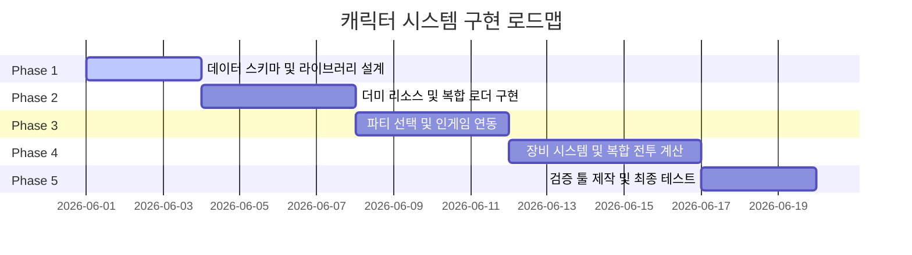

# LLL 캐릭터 시스템 구현 마일스톤

본 문서는 캐릭터 시스템 기획서를 기반으로, 코덱스(AI 개발 환경) 및 작업자들이 캐릭터 시스템을 구축하고 전투 시스템에 통합하기 위한 세부 마일스톤 및 구현 로드맵을 정의합니다.

---

## 📅 구현 마일스톤 개요

---

## 🛠️ 단계별 세부 작업 명세 (Task Breakdown)

### Phase 1. 데이터 모델 및 스키마 설계 (설계 및 기초 구축)
캐릭터 시스템의 기반이 되는 데이터 컨테이너 및 관리 라이브러리 구조를 구성합니다.

- [x] **CharacterData ScriptableObject 구현**
  - 고유 ID, 표시 이름, 클래스, 아군/적군 분류, 사용 스킬 인덱스 배열 필드 설계.
  - 4대 기본 리소스(포트레이트, 전투 도트, 스킬 애니메이션 2종) 참조 필드 생성.
- [x] **CharacterStats JSON 스키마 정의 및 파서 구현**
  - 레벨, 경험치, 요구 경험치 테이블 정보 스키마 정의.
  - 레벨별 성장 능력치(체력, 물리력, 방어력, 마법력, 저항력) 구조 구축.
  - `JsonLoadManager`가 캐릭터 수치 JSON을 게임 시작 시 미리 로드하고 캐싱한 뒤, 요청 시 데이터를 전달하는 구조로 작성.
  - 추후 스토리 대화 씬 데이터, 직렬화된 세이브 데이터 등 추가 JSON 데이터도 `JsonLoadManager`를 통해 로드하도록 확장 가능하게 설계.
- [x] **SOManager 기반 SO 요청 흐름 반영**
  - 캐릭터/스킬 SO 데이터의 최초 요청은 `SOManager`를 경유하도록 조회 메서드 구성.
  - 다른 인스턴스가 이니셜라이즈 타임에 데이터를 받아 이후 사용하는 경우를 제외하고, SO 에셋에 직접 요청하지 않는 구조를 유지.
- [ ] **PlayerDataLibrary SO 구현**
  - 게임 전체 플레이어블 캐릭터 세트를 정의하는 공통 SO.
  - `SOManager`에 할당되어 관리되며, 모든 `InStageManager`가 공통으로 참조.
  - 인덱스 기반으로 특정 캐릭터의 `CharacterData SO`를 반환하는 조회 메서드 포함.
- [ ] **Enemy Data Library 이중 구조 구현**
  - **Stage Enemy Data Library**: 스테이지별 등장 적 세트를 정의하는 개별 SO. 각 `InStage` 씬의 `InStageManager`가 인스펙터에서 직접 참조하며, 다른 런타임 객체는 임의 접근 불가.
  - **Master Enemy Data Library**: 전체 적(일반 30종, 보스 10종)의 `CharacterData SO`를 한곳에 취합한 통합 SO. `SOManager`에 할당되어 도감, 디버그, 검증, 예외 소환 등 보조 목적으로만 사용.
- [ ] **SOManager 역할 범위 확정 반영**
  - `PlayerDataLibrary SO`와 `Master Enemy Data Library SO`를 `SOManager`에 필드로 할당.
  - 외부에서 전체 플레이어/적 데이터 조회가 필요할 경우 반드시 `SOManager`를 경유하도록 조회 인터페이스 설계.
- [ ] **클래스 및 상성 데이터 모델 추가 설계**
  - 캐릭터 SO 에셋에서 선택 가능한 `상성 클래스(Affinity Class)` Enum 데이터 구현 (5종).
  - 플레이어 직업군 계층 구조(베이스/서브 클래스) 설계.
  - 플레이어와 이원화된 **독립형 적 전용 클래스(종족/유형 태그)** 데이터 구조 설계.
- [ ] **적 캐릭터 사이즈 및 가변 스킬 데이터 설계**
  - 적 캐릭터 고유 **사이즈(소형 1칸, 중형 2칸, 대형 3칸)** 속성 필드 추가.
  - 적 캐릭터를 위한 **가변 스킬 보유 구조(1개 또는 다수)** 및 턴당 행동 패턴(조건부 랜덤 스킬 조건) 스키마 정의.

---

### Phase 2. 더미 리소스 매핑 및 복합 로더 구현 (기능 프로토타이핑)
고유 그래픽 없이도 시스템 빌드가 가능하도록 더미 리소스를 연동하고, 두 종류의 캐릭터 데이터를 실시간으로 합성하는 로직을 개발합니다.

- [ ] **임시 더미 리소스 준비 및 바인딩**
  - 흰색 단색 정사각형 스프라이트, 기본 형태의 테스트용 도트 스프라이트 생성.
  - 임시 스킬 사용 이펙트 애니메이션 에셋 설정.
  - `CharacterData SO`에 이 더미 리소스들을 기본값으로 할당.
- [ ] **실시간 데이터 복합 로더 (Character Data Resolver) 구현**
  - 캐릭터 고유 ID를 키값으로 사용.
  - `CharacterData SO`에서 리소스, 고정 정보(클래스/상성/사이즈 정보 포함)를, `JsonLoadManager`에서 현재 레벨에 따른 수치 스탯을 조회하여 런타임에 결합된 최종 `Character` 인스턴스를 반환하는 시스템 구현.
  - 플레이어 캐릭터 조회: `PlayerDataLibrary`(→ `SOManager` 경유) 기반.
  - 적 캐릭터 조회: `Stage EnemyDataLibrary`(`InStageManager` 직접 참조) 기반. ID 미존재 예외 시에만 `SOManager`의 `MasterEnemyDataLibrary`로 폴백.

---

### Phase 3. 3인 파티 선택 및 인게임 씬 연동 (흐름 제어)
선택 씬에서의 파티 구성 흐름과 인게임 진입 시 보석판 및 전투 시스템에 스킬을 바인딩하는 로직을 연계합니다.

- [ ] **`StageSelectScene` 파티 선택 시스템 개발**
  - `PlayerDataLibrary`를 조회하여 전체 보유 캐릭터 목록을 표시하는 선택 UI 구현.
  - 스테이지 선택 후, 3인의 플레이어 캐릭터를 선택하여 아래 정보를 씬 전환 시 전달:
    - 선택된 캐릭터 인덱스 (라이브러리 기준)
    - 인덱스 순서 (전투 필드 배치 순서 결정용)
    - 각 캐릭터의 현재 장비, 스킬 강화 상태, 레벨 데이터
- [ ] **인게임 진입 시 캐릭터 로드 및 공간 점유 연산**
  - `InStageManager` 초기화 시, 전달받은 파티 정보를 기반으로 `PlayerDataLibrary`에서 3인의 베이스 데이터를 조회하여 아군 전투 오브젝트 생성.
  - `InStageManager`가 직접 참조 중인 `Stage EnemyDataLibrary`를 기준으로 등장 후보군을 선정하고 적 스폰.
  - 스폰 시 **적의 사이즈(소형/중형/대형)를 계산하여 전투 배치 공간 점유(1~3칸)** 및 배치 UI 맵핑 기능 구현.
- [ ] **보석판 스킬 동적 바인딩 연계**
  - `CharacterSkillLoadout`을 보강하여 선택된 플레이어 3인의 소유 스킬 인덱스들을 수집.
  - `JewelManager.Initialize` 시에 이 수집된 스킬 인덱스들을 `activeSkillIndices`로 전달하여 보석판에 동적으로 바인딩.

---

### Phase 4. 장비 시스템 및 복합 전투 데미지 계산식 구현 (전투 핵심 시스템)
스탯 증폭 및 특수 효과가 데미지 계산식에 유기적으로 연산되는 전투 시스템 핵심 로직을 구현합니다.

- [ ] **장비(Equipment) 데이터 모델 설계**
  - 무기, 갑옷, 장신구 1, 장신구 2에 대응하는 장비 SO 혹은 JSON 구조체 설계.
  - 추가 능력치(스탯 보너스) 및 특수 효과 태그(예: 치명타, 쉴드 확률 등) 정의.
- [ ] **캐릭터 최종 스탯 연산기 구현**
  - `(기본 스탯 + 레벨 성장 스탯 + 장비 추가 스탯) * 장비 곱연산율` 등 실시간 최종 능력치를 산출하는 스탯 핸들러 구축.
- [ ] **적 캐릭터 행동 패턴 AI 엔진 구현**
  - 턴당 지정 패턴 또는 가변 스킬 중 **조건별 랜덤 선택 패턴 연산** 알고리즘 구현.
- [ ] **상성 관계 연산 및 태그 시너지 판정 엔진 구현**
  - 상성 클래스(A, B, C 삼항 상성 및 D, E 특수 상성)에 대조한 피해량 배율(증가/감소) 연산 기능 개발.
  - 공격자/피격자의 클래스(플레이어 직업 계층/적 종족 클래스 개별 판정 적용) 및 상성 클래스를 태그 검사하여 조건부 시너지 효과 연산 로직 구현.
- [ ] **복합 데미지/힐 계산식 반영 및 크기 연산 (`BattleController`)**
  - 기존의 `ResolveDamageSkill`, `ResolveHealSkill`, `ResolveBlockSkill`을 리팩터링.
  - 스킬 시전자 스탯(물리/마법력) + 스킬 계수 + 스킬 고정치 + 대상 피격자 방어 스탯 및 대상의 장비 감쇄 효과를 모두 취합하여 최종 데미지를 가감산 처리하는 복합 연산 로직 구현.
  - 여기에 상성 클래스 피해 배율, 태그 시너지 배율 적용.
  - **적의 사이즈에 따른 다중 타겟 피격 범위 연산** 적용 (2~3칸 점유 적에 대한 광역/일인 스킬 피격 판정 연동).

---

### Phase 5. 데이터 정합성 검증 툴 및 테스트 (안정성 확보)
수치 테이블과 기획 파일 간 누락이 발생하지 않도록 감지 툴을 제공하고 연동 동작을 테스트합니다.

- [ ] **에디터용 데이터 정합성 검증기(Validator) 제작**
  - `PlayerDataLibrary` 및 `Master Enemy Data Library` SO 에셋에 할당된 ID와 JSON 데이터에 등록된 ID의 1:1 매칭 확인.
  - `Stage EnemyDataLibrary`에 정의된 적 ID가 `Master Enemy Data Library`에 존재하는지 교차 검증.
  - JSON 내 필수 레벨 구간 데이터 누락 여부 확인.
  - SO 에셋의 필수 리소스(스프라이트, 애니메이션) 미할당 상태 감지 기능 제공.
- [ ] **전투 시뮬레이션 및 수치 테스트**
  - 아군 3인 및 다양한 사이즈(중형/대형)의 적 배치 테스트 전투 씬 작동 확인.
  - 보석 7개 Pop 시, 정상적으로 시전 캐릭터 스펙, 상성, 피격 범위가 반영되어 최종 데미지가 계산되는지 검증.
  - `Stage EnemyDataLibrary` → (폴백) `MasterEnemyDataLibrary` 조회 흐름이 정상 동작하는지 확인.
