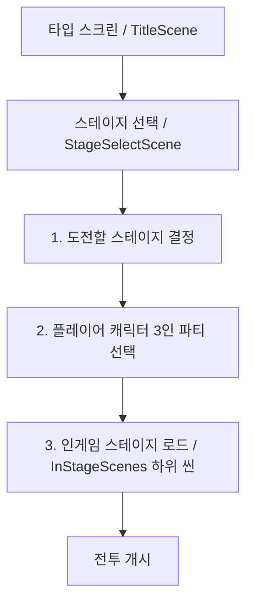
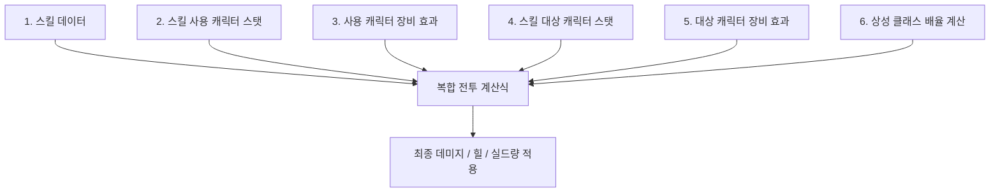
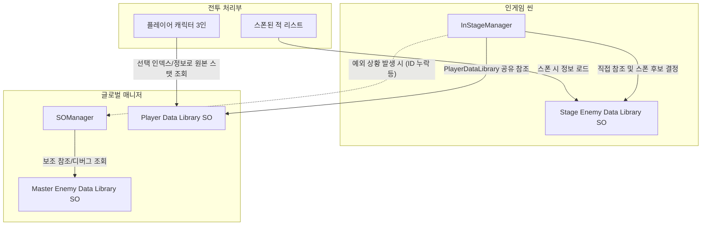

# LLL 캐릭터 시스템 기획서

## 1. 개요 및 목적
본 기획서는 LLL 프로젝트의 전투 시스템에 탑재될 아군(Player) 및 적(Enemy) 캐릭터의 데이터 구조, 스탯 성장 메커니즘, 클래스 및 상성 관계, 장비 슬롯 구성, 그리고 복합 전투 데미지 계산 방식을 정의합니다. 또한, 향후 추가 캐릭터 리소스 및 데이터를 원활하게 연동하기 위한 설계 방향성과 데이터 관리 방식을 제안합니다.

---

## 2. 캐릭터 시스템 상세 명세

### 2.1 개발 캐릭터 규모 (목표 수치)
개발 및 확장을 목표로 하는 플레이어 및 적 캐릭터의 대략적인 수량입니다. (추후 변동 가능)
- **플레이어 캐릭터**: 약 10종
- **적 캐릭터**: 
  - **일반 적**: 약 30종
  - **보스 적**: 약 10종

### 2.2 캐릭터 스탯 구조
캐릭터의 스탯은 **고정 필드**, **기본 능력치 및 성장 능력치**, 그리고 **상태 능력치**로 분류됩니다. 추후 기획 의도에 따라 능력치 항목이 유연하게 추가되거나 삭제될 수 있도록 확장성을 고려해 설계합니다.

#### A. 고정 필드 (ReadOnly)
캐릭터의 식별 및 역할 정의를 위한 고정 데이터입니다.
- **캐릭터 이름 (Name)**: 게임 내 표기될 이름
- **상성 클래스 (Affinity Class)**: 전투 간 상성 보너스를 결정하는 속성 (약 5종 중 1가지 선택)
- **클래스 (Class)**: 캐릭터의 컨셉적 직업 (플레이어 캐릭터와 적 캐릭터의 클래스 구조 분리)
- **사용 스킬 인덱스 배열**: 캐릭터가 사용할 스킬 라이브러리 내 인덱스
  - **플레이어**: 기본 2개 (추후 확장 가능)
  - **적**: 가변적 (1개만 소유하거나, 2개 이상 다수 보유 가능)
- **사이즈 (Size - 적 전용)**: 전투 배치 시 점유하는 공간 크기
  - **소형 (Small)**: 1칸 점유 (기본)
  - **중형 (Medium)**: 2칸 점유
  - **대형 (Large)**: 3칸 점유

#### B. 성장 능력치 (Level-based Stats)
레벨에 따라 증가하는 능력치로, 캐릭터별로 고유한 성장 곡선(성장률)을 적용합니다.
- **체력 (HP)**: 최대 체력 값
- **물리력 (Physical Power)**: 물리 기반 공격 및 스킬의 위력 기준값
- **방어력 (Physical Defense)**: 물리 피해 감쇄 기준값
- **마법력 (Magic Power)**: 마법 기반 공격 및 스킬의 위력 기준값
- **저항력 (Magic Defense)**: 마법 피해 감쇄 기준값

#### C. 레벨 및 경험치 스탯 (State Stats)
플레이 중 지속적으로 변화하는 스탯입니다.
- **현재 레벨 (Level)**: 캐릭터의 현재 레벨
- **현재 경험치 (Current EXP)**: 현재 레벨에서 누적한 경험치
- **요구 경험치 (Required EXP)**: 레벨업을 위해 필요한 경험치로, 레벨 구간별 테이블이 존재하며 캐릭터별로 직접 성장값을 입력할 수 있도록 구성합니다.

---

### 2.3 클래스 및 상성 시스템 명세
캐릭터들은 상호작용 및 시너지 효과 계산을 위해 **상성 클래스**와 **클래스**라는 두 가지 개념적 태그를 가집니다.

#### A. 상성 클래스 (Affinity Class)
전투 시 캐릭터 간 피해량 증감을 유도하는 가위바위보 및 특수 상성 구조입니다. (총 5종 제공)
- **상성 관계 예시**:
  - **A, B, C 클래스**: 서로 순환형 가위바위보 상성 관계를 가집니다. (A > B > C > A)
  - **D, E 클래스**: D는 E에게 매우 유리합니다. 반면 E는 삼항 상성 클래스(A, B, C) 전체에 대해 약한 유리함을 가집니다.
- **역할 및 용도**:
  - 공격자와 피격자의 상성 클래스 대조를 통해 **데미지 보너스(배율 증감)** 계산.
  - 특정 광역 버프나 패시브의 **적용 대상 식별 태그**로 활용.

#### B. 클래스 (Class - 플레이어와 적의 구조 분리)
캐릭터의 직업/종족 구분을 나타내는 태그이며, 게임 밸런스 및 조건 판단을 용이하게 하기 위해 플레이어 캐릭터 클래스와 적 캐릭터 클래스를 이원화된 독립 구조로 분리하여 설계합니다.

##### 1) 플레이어 캐릭터 클래스 (계층 구조)
- **베이스 클래스(Base Class)**와 **서브 클래스(Sub Class)**의 계층(상속) 관계로 설계됩니다.
- **구조 예시**:
  - `Warrior` (베이스 클래스) ◀── `Knight` (서브 클래스)
  - `Priest` (베이스 클래스) ◀── `Cleric` (서브 클래스)
- **상속 규칙**:
  - 캐릭터 SO 에셋에서 서브 클래스(예: `Knight`)를 선택하면, 시스템상으로 해당 서브 클래스가 포함하는 베이스 클래스(`Warrior`)도 동시에 보유하는 것으로 판정합니다.
  - 따라서, "모든 `Warrior` 클래스에게 방어력 10% 증가 버프 적용"이라는 효과가 발동하면, `Knight` 클래스를 가진 캐릭터도 해당 효과를 같이 적용받습니다.

##### 2) 적 캐릭터 클래스 (독립 종족/유형 구조)
- 플레이어의 인간형 직업군과 구분되는, 적 고유의 클래스 체계로 설계됩니다.
- **구조 예시**:
  - `Beast` (야수형), `Undead` (불사형), `Golem` (마도인형), `Demon` (마족형) 등.
  - 적 캐릭터는 복잡한 계층 관계보다는 종족 특화형 시너지 판정(예: "Undead 클래스에 대해 Holy 스킬 피해량 50% 증가" 등)의 단순 태그 형태로 사용됩니다.

---

### 2.4 적 캐릭터 행동 및 스킬 패턴 명세
적 캐릭터는 턴마다 지정된 행동 로직(AI 패턴)에 따라 보유한 스킬 중 하나를 트리거하여 사용합니다.

- **스킬 보유 유연성**:
  - 1개의 단순 공격 스킬만 지니는 일반 적부터, 3~4개의 복합 유틸리티 스킬을 보유하는 네임드/보스 적까지 유연하게 스킬 개수를 설정할 수 있습니다.
- **턴별 행동 패턴 연산**:
  - **확정 패턴**: 턴(혹은 체력 조건)에 따라 정해진 특정 스킬을 무조건 발동하는 패턴.
  - **조건부 랜덤**: 특정 조건(예: "아군 쉴드가 존재할 때", "자신의 체력이 30% 이하일 때" 등)을 충족하는 스킬 후보들을 필터링하고, 해당 후보군 중 임의의 무작위 스킬을 랜덤 시전하는 패턴.

---

### 2.5 CharacterData SO 입력 방식 및 Custom Editor 정책
캐릭터 SO는 플레이어와 적을 별도 상속 SO로 분리하지 않고, **단일 `CharacterData SO`**를 사용합니다. 대신 Unity Editor의 **Custom Editor**를 통해 `Type` 값에 따라 인스펙터에 표시되는 필드를 제어합니다.

- **공통 표시 필드**:
  - Character ID
  - Display Name
  - Type
  - Affinity
  - BaseClass
  - SubClass
  - 종족/적 클래스
  - Skill Indices
  - 스킬별 Animation
  - Portrait
  - Battle Sprite
- **적/보스 전용 표시 필드**:
  - Size
  - 행동 패턴(Pattern)
- **플레이어 전용 처리**:
  - 플레이어 캐릭터의 Size는 시스템상 1칸으로 고정합니다.
  - 플레이어 타입에서는 Size 및 행동 패턴 필드를 인스펙터에서 숨깁니다.

이 구조는 공통 필드가 많은 현재 캐릭터 구조를 단순하게 유지하면서, 향후 필드 변경이 발생해도 SO 타입 분리로 인한 중복 수정과 라이브러리 타입 분기를 줄이기 위한 결정입니다. Custom Editor는 표시 제어만 담당하며, 데이터 정합성 검증은 별도 Validator에서 처리합니다.

---

### 2.6 캐릭터 리소스 바인딩 (4대 기본 리소스)
캐릭터가 사용하는 고유 그래픽 및 애니메이션 리소스는 인덱스를 통해 참조 및 매핑됩니다. (추후 추가 리소스 확장 가능)
1. **캐릭터 포트레이트 (Portrait Index)**: 캐릭터 선택화면, UI 등에서 사용할 일러스트/스프라이트 인덱스
2. **캐릭터 도트 이미지 (Battle Sprite Index)**: 전투 필드 상에서 아군/적으로 배치되어 사용될 도트 그래픽 인덱스
3. **전투 애니메이션 1 (Skill 1 Animation Index)**: 첫 번째 스킬 사용 시 재생될 전투 애니메이션 인덱스
4. **전투 애니메이션 2 (Skill 2 Animation Index)**: 두 번째 스킬 사용 시 재생될 전투 애니메이션 인덱스 (가변적인 적 스킬의 경우 보유한 스킬 개수에 대응하여 추가 매핑 연동)

> [!NOTE]
> **개발용 더미 리소스 활용 계획**
> - 실리적인 개발 진행을 위해, 고유 리소스(도트, 포트레이트, 이펙트 애니메이션 등)가 최종 제작되어 프로젝트에 배치되기 전까지는 임시 **더미 리소스**를 적극적으로 활용합니다.
> - **임시 리소스**: 단색(흰색 등) 정사각형 스프라이트, 기본 형태의 더미 도트 및 범용 폭발/공격 이펙트를 할당해 시스템을 빌드하고 검증합니다.

---

### 2.7 장비 시스템
캐릭터는 총 4개의 장비 슬롯을 제공받으며, 각 장비는 고유의 추가 스탯 및 특수 부가 효과를 가집니다.
- **장비 슬롯 구성**:
  1. **무기 (Weapon)**
  2. **갑옷 (Armor)**
  3. **장신구 1 (Accessory 1)**
  4. **장신구 2 (Accessory 2)**
- **적용 방식**:
  - 장비 장착 시 장비에 명시된 스탯 보너스(합연산/곱연산)가 캐릭터의 실시간 최종 능력치에 합산 반영됩니다.
  - 특정 장비는 특수 패시브 및 스킬 부가 효과(예: "Warrior 클래스의 치명타 확률 5% 증가", "A 상성 클래스에게 받는 피해 10% 감쇄" 등)를 가집니다.

---

## 3. 인게임 진입 및 파티 구성 흐름

전투 콘텐츠가 진행되는 인게임 스테이지에 진입하기까지의 단계별 유저 흐름입니다.

1. **도전 스테이지 결정**:
   - `StageSelectScene`에서 유저가 입장할 특정 스테이지(예: 튜토리얼, 동굴 등)를 터치/선택합니다.
2. **플레이어 파티 구성 (3인 구성)**:
   - 스테이지 진입 전, 플레이어는 보유한 캐릭터 중 전투에 동반할 **3명의 플레이어 캐릭터**를 선택합니다.
   - `StageSelectScene`은 플레이어가 선택한 **캐릭터의 인덱스, 인덱스 순서(배치 순서), 장비, 스킬 강화 상태, 레벨 데이터**를 씬 전환 시 전달합니다.
3. **인게임 스테이지 진입**:
   - `Assets/Scenes/InStageScenes` 하위의 해당 스테이지 씬이 실행됩니다.
   - `InStageManager`와 `BattleController`가 호출되며 3인의 플레이어 캐릭터 정보 및 해당 스테이지의 적 정보가 메모리에 올라옵니다.
   - **적 캐릭터 배치 및 스폰 연산**:
     - 적 캐릭터는 스폰될 때 자신의 **사이즈(소형 1칸, 중형 2칸, 대형 3칸)**를 판정하여 전투 필드의 점유 영역을 계산하고 UI에 동적으로 맵핑됩니다.

---

## 4. 복합 전투 계산 구조
전투 중 스킬 발동 시, 데미지 및 피격 판정은 스킬 데이터 단독 계산이 아닌 아래의 주체들을 모두 종합하여 연산합니다.

- **스킬 시전 시 계산 요소**:
  - **공격자 요인**: 시전자(캐릭터)의 현재 레벨 기준 스탯(물리력/마법력) + 장비 추가 스탯 + 장비의 스킬 증폭 효과
  - **스킬 요인**: 스킬 데이터(`SkillData`) 내에 정의된 물리/마법 계수 및 레벨별 고정 상수 값
  - **피격자(대상) 요인**: 대상(캐릭터)의 방어력/저항력 스탯 + 대상의 장비 방어 효율 및 데미지 감쇄 부가 효과. 대상 적이 대형/중형 사이즈일 경우, 광역 스킬 피격 시 다중 타겟 피격 판정이 어떻게 분할/중복될 것인지에 대한 조건식 추가 적용.
  - **상성 클래스 보너스 요인**: 공격자와 대상 간의 **상성 클래스** 대조 결과에 따른 피해 배율(증폭 혹은 감소) 적용
  - **태그 판정 요인**: 스킬 시전자 및 대상의 **클래스(플레이어 직업 계층/적 종족 클래스 개별 분리 적용)** 및 **상성 클래스** 태그를 대조하여 장비/스킬의 조건부 특수 효과(예: "Undead 적 캐릭터 타격 시 물리 공격력 25% 추가" 등) 연산 반영
- **산출 공식 (예시 방향성)**:
  $$\text{최종 피해량} = (\text{공격자 물리/마법력} \times \text{스킬 계수} + \text{스킬 고정치}) \times (1 - \text{대상의 방어/저항 감쇄율}) \times \text{상성 클래스 배율} \times \text{시너지 배율}$$
  *(※ 세부 수식 및 계수 적용 방식은 수치 기획 확정 시 최종 조율 예정)*

---

## 5. 라이브러리 및 데이터 관리 구조

캐릭터들의 원활한 추가와 통합 관리를 위해 데이터 라이브러리 구조를 전면적으로 개편하여 적용합니다.

### 5.1 Player Data Library (플레이어 라이브러리)
- **역할**: 게임에 존재하는 모든 플레이어블 캐릭터 세트를 정의하고 관리하는 공통 SO입니다.
- **참조 방식**: 
  - 모든 `InStage` 씬의 `InStageManager`가 하나의 공통 `PlayerDataLibrary SO`를 직접 참조합니다.
  - `StageSelectScene`은 플레이어가 선택한 캐릭터의 인덱스, 인덱스 순서(캐릭터 배치 순서), 장비, 스킬 강화, 레벨 데이터 등 상태 정보만 전달합니다.
  - 스테이지 진입 시 `InStageManager`는 전달받은 인덱스와 순서 정보를 기준으로 `PlayerDataLibrary SO`에서 캐릭터의 베이스(원본) 데이터를 조회하고, 장비 및 레벨 상태를 결합해 전투용 플레이어 캐릭터 데이터를 구성합니다.
  - 플레이어 캐릭터의 베이스 데이터 조회 기준은 `StageSelectScene`에서 전달된 인덱스 순서를 따르며, 이 순서는 인게임 배치 순서 결정에도 사용됩니다.

### 5.2 Enemy Data Library 구조화 및 분리
적 라이브러리는 스테이지 단위의 최적화된 로딩을 위한 **스테이지별 라이브러리**와, 예외적 상황을 대비한 **마스터 라이브러리**로 구분합니다.

#### A. Stage Enemy Data Library (스테이지별 적 라이브러리)
- **역할**: 해당 스테이지에 등장하는 적 세트를 정의하는 전용 SO입니다.
- **참조 및 스폰 규칙**:
  - 각 `InStage` 씬의 `InStageManager`가 자신이 사용할 `Stage EnemyDataLibrary SO`를 직접 인스펙터 상에서 참조합니다.
  - 전투 시작 시, `InStageManager`는 자신이 직접 참조 중인 이 라이브러리를 기준으로 등장 후보군을 선정하고 적을 스폰합니다.
  - 전투 중 실제 스폰 기준은 항상 `InStageManager`에 할당된 `Stage EnemyDataLibrary SO`를 따릅니다.
  - 다른 런타임 객체들은 이 라이브러리를 임의로 조회하거나 직접 접근할 수 없습니다 (캡슐화 보장).

#### B. Master Enemy Data Library (마스터 적 라이브러리)
- **역할**: 게임 전체에 정의된 모든 적(일반 30종, 보스 10종)의 CharacterData SO를 한곳에 취합한 백업/조회용 통합 SO입니다.
- **참조 및 예외 규칙**:
  - 기본 스폰 목적으로는 절대 사용하지 않습니다.
  - 도감 시스템, 디버그, 데이터 정합성 검증, 특수 소환(예: 예외적 난입), 다른 스테이지 적 데이터 참조, 혹은 현재 스테이지 라이브러리 SO 내에 적 ID가 누락되는 등의 예외적 상황에 한해서 보조 조회용으로만 접근합니다.
  - 특정 적 ID의 원본 정보가 스테이지 라이브러리에 없거나 예외 참조가 필요한 경우에만 `SOManager`를 통해 조회합니다.

### 5.3 SOManager의 중앙 관리 역할
프로젝트의 공통 및 조회 목적의 전역 SO 라이브러리는 `SOManager`를 통해 안전하게 중재됩니다.
- `SOManager`는 **`PlayerDataLibrary SO`**와 **`Master Enemy Data Library SO`**를 보유 및 관리합니다.
- 외부 시스템이나 다른 런타임 객체에서 전체 적 데이터 목록이 필요하거나, 예외적으로 데이터 조회가 필요할 때는 직접 라이브러리를 찾지 않고, 반드시 `SOManager`를 경유해 데이터를 요청하는 흐름을 준수합니다.
- `Stage EnemyDataLibrary SO`는 씬별 `InStageManager`가 직접 참조하지만, 다른 런타임 객체가 임의로 해당 SO 에셋을 찾거나 직접 요청하지 않도록 합니다.

---

## 6. 데이터 관리 방식 비교 및 제안

캐릭터 데이터를 구조화하고 추가할 때의 구현 모델인 **SO (ScriptableObject) 에셋 방식**과 **JSON 파일 방식**의 비교 분석입니다.

| 비교 항목 | SO (ScriptableObject) 에셋 방식 | JSON 파일 방식 |
| :--- | :--- | :--- |
| **리소스 연동 편의성** | **[매우 우수]** 유니티 에디터 인스펙터 상에서 Sprite, Animator, Prefab 등을 드래그 앤 드롭으로 직접 참조 가능 | **[다소 불편]** 리소스 경로 문자열(Resources/Addressables) 또는 고유 인덱스를 통해 간접 로드해야 하므로 누수 위험 존재 |
| **데이터 입력 및 편집** | **[보통]** 각 캐릭터마다 `.asset` 파일을 개별 생성하여 수정해야 하므로 대용량 수정 시 번거로움 | **[우수]** 구글 시트, 엑셀 등으로 데이터를 정리한 뒤 일괄 JSON 변환 및 텍스트 파일 복사 붙여넣기로 일괄 갱신 용이 |
| **모딩 및 패치 유연성** | **[다소 낮음]** 데이터 수정 시 유니티 에디터에서 재빌드 및 번들 업데이트가 필요함 | **[매우 우수]** 서버에서 단순 텍스트 파일을 내려받아 실시간 반영(Live Update) 및 외부 유저 모딩이 편리함 |
| **타입 안정성** | **[매우 우수]** 컴파일 시점에 변수 타입 및 누락 여부가 에디터 내에서 보증됨 | **[보통]** 런타임에 파싱 오류가 발생할 수 있어 수치 유효성 검사 코드가 필수적임 |

### 6.1 최종 추천 제안: 하이브리드(SO 기반 수치 연동) 방식
1. **구현 방향성**: 리소스를 직접 참조하여 사용할 수 있는 **SO (ScriptableObject) 에셋** 방식을 기반 기술로 채택합니다.
2. **수치 편집성 보완**: 캐릭터 테이블의 성장률, 경험치 테이블 등의 대규모 수치 데이터는 **CSV/JSON 파일**로 작성하여 관리하고, 유니티 에디터 툴(Editor Script)을 통해 버튼 클릭 한 번으로 **JSON 수치 데이터를 SO 에셋에 자동으로 덮어씌워 갱신(Bake)**하는 도구를 제공합니다.
3. **기대 효과**: 기획자는 엑셀로 편하게 밸런싱을 조율하고, 개발자는 유니티 인스펙터 상에서 에셋 참조 누락 걱정 없이 완벽하게 리소스를 맵핑할 수 있습니다.

### 6.2 확정 구현 방향: SO 에셋 + JSON 데이터의 복합 로드
캐릭터 추가 방식은 **SO 에셋을 캐릭터의 고정 정보 및 리소스 참조 본체로 사용**하고, **JSON 파일을 수치 데이터의 저장소로 사용**하는 구조로 결정했습니다.

- **CharacterData SO**: 캐릭터 ID, 표시 이름, 클래스(플레이어 직업 계층/적 종족 클래스 개별 분리 적용), 상성 클래스, 플레이어/적 구분, 스킬 인덱스 또는 스킬 참조, 포트레이트, 전투 스프라이트, 애니메이션/아트 리소스 등 Unity 리소스를 직접 연결하는 값을 보유합니다. 적의 경우 추가로 **사이즈(소형/중형/대형)** 필드를 포함합니다.
- **CharacterStats JSON**: 캐릭터 ID별 레벨 스탯, 경험치, 성장 수치 등 대량으로 작성·수정해야 하는 값을 보유합니다.
- **JsonLoadManager**: 캐릭터 수치 JSON을 포함해, 추후 스토리 대화 씬 데이터, 직렬화된 세이브 데이터 등 게임 내 JSON 데이터를 총괄 로드하고 캐싱하는 Manager입니다. 게임 시작 시 필요한 JSON 데이터를 미리 로드해 보관하고, 다른 시스템은 직접 JSON 파일을 읽지 않고 `JsonLoadManager`에 요청해 데이터를 전달받습니다.
- **실시간 적용 방식**: 전투 진입 시 플레이어가 선택한 캐릭터 또는 스테이지에서 스폰되는 적 캐릭터의 ID를 기준으로 SO의 고정/리소스 정보와 `JsonLoadManager`가 제공하는 JSON 수치 정보를 결합하여 전투용 최종 캐릭터 데이터를 생성합니다.
- **검증 필요 항목**: SO에는 존재하지만 JSON 수치가 없는 캐릭터, JSON에는 존재하지만 SO가 없는 캐릭터, 중복 캐릭터 ID, 레벨 테이블 누락, 필수 리소스 미할당 상태를 개발/테스트 단계에서 확인할 수 있어야 합니다.

이 구조를 통해 캐릭터별 수치값은 JSON으로 일괄 관리하고, Unity 리소스 참조와 전투 시스템 연결은 SO를 통해 안정적으로 관리합니다.
